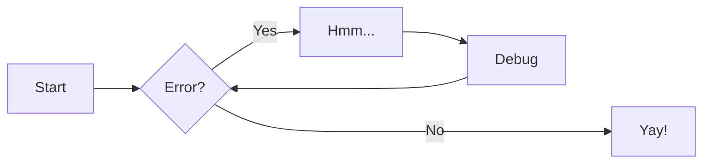

# Geomix 2.0 Docs 

## Плюсы

* быстрый запуск портала документации
* масштабируемость
* поддержка версионирования и мультиязычности из коробки

## А минусы будут?

* нужно кастомизировать UI
* некоторых директив нет из коробки (но это решается поиском в гугле и дописыванием их в mkdocs.yml)

## в итоге:

* есть всё, что нужно техписателю для работы
* нет проблем при установке и генерации доки локально
* markdown классный :)

-   :material-clock-fast:{ .lg .middle } __Set up in 5 minutes__

    ---

    Install [`mkdocs-material`](#) with [`pip`](#) and get up
    and running in minutes

    [:octicons-arrow-right-24: Getting started](#)

-   :fontawesome-brands-markdown:{ .lg .middle } __It's just Markdown__

    ---

    Focus on your content and generate a responsive and searchable static site

    [:octicons-arrow-right-24: Reference](#)

-   :material-format-font:{ .lg .middle } __Made to measure__

    ---

    Change the colors, fonts, language, icons, logo and more with a few lines

    [:octicons-arrow-right-24: Customization](#)

-   :material-scale-balance:{ .lg .middle } __Open Source, MIT__

    ---

    Material for MkDocs is licensed under MIT and available on [GitHub]

    [:octicons-arrow-right-24: License](#)

!!! note "Phasellus posuere in sem ut cursus"

    Lorem ipsum dolor sit amet, consectetur adipiscing elit. Nulla et euismod
    nulla. Curabitur feugiat, tortor non consequat finibus, justo purus auctor
    massa, nec semper lorem quam in massa.

!!! danger

    Lorem ipsum dolor sit amet, consectetur adipiscing elit. Nulla et euismod nulla. Curabitur feugiat, tortor non consequat finibus, justo purus auctor massa, nec semper lorem quam in massa.

!!! note ""

    Lorem ipsum dolor sit amet, consectetur adipiscing elit. Nulla et euismod
    nulla. Curabitur feugiat, tortor non consequat finibus, justo purus auctor
    massa, nec semper lorem quam in massa.

---

[Hover me](https://example.com "О нет, я тултип!")

<figure markdown="span">
  { width="300" }
  <figcaption>Image caption</figcaption>
</figure>

Text can be {--deleted--} and replacement text {++added++}. This can also be
combined into {~~one~>a single~~} operation. {==Highlighting==} is also
possible {>>and comments can be added inline<<}.

{==

Formatting can also be applied to blocks by putting the opening and closing
tags on separate lines and adding new lines between the tags and the content.

- H~2~O
- A^T^A

==}

## Заголовок 2 уровня

специализированный программный продукт для информационной поддержки горного производства, объединяющий решения наиболее востребованных задач в единую IT-инфраструктуру, легко адаптируемую и расширяемую под нужды конкретного предприятия.

++ctrl+alt+del++

Lorem ipsum dolor sit amet, (1) consectetur adipiscing elit.
{ .annotate }

1.  :man_raising_hand: Морти, я аннотация! Я могу содержать `code`, __форматированный текст__, изображения, ... ну и вообще всё, что только может Markdown.

### Заголовок 3 уровня

??? note

    Lorem ipsum dolor sit amet, consectetur adipiscing elit. Nulla et euismod
    nulla. Curabitur feugiat, tortor non consequat finibus, justo purus auctor
    massa, nec semper lorem quam in massa.

#### Заголовок 4 уровня

!!! info inline end "Lorem ipsum"

    Lorem ipsum dolor sit amet, consectetur
    adipiscing elit. Nulla et euismod nulla.
    Curabitur feugiat, tortor non consequat
    finibus, justo purus auctor massa, nec
    semper lorem quam in massa.

##### Заголовок 5 уровня

??? tip

    Lorem ipsum dolor sit amet, consectetur adipiscing elit. Nulla et euismod
    nulla. Curabitur feugiat, tortor non consequat finibus, justo purus auctor
    massa, nec semper lorem quam in massa.

###### Заголовок 6 уровня

I just love **bold text**.
The *best* italic practices.

> #### The quarterly results look great!
>
> - Revenue was off the chart.
> - Profits were higher than ever.
>
>  *Everything* is going according to **plan**.

### Списки

#### нумерованный список

1. First item
2. Second item
3. Third item
4. Fourth item 

#### ненумерованный список

* First item
* Second item
* Third item
* Fourth item 

### Таблицы

| Method      | Description                          |
| ----------- | ------------------------------------ |
| `GET`       | :material-check:     Fetch resource  |
| `PUT`       | :material-check-all: Update resource |
| `DELETE`    | :material-close:     Delete resource |

### уравнения, расчеты, спец.символы

$$
\operatorname{ker} f=\{g\in G:f(g)=e_{H}\}{\mbox{.}}
$$

